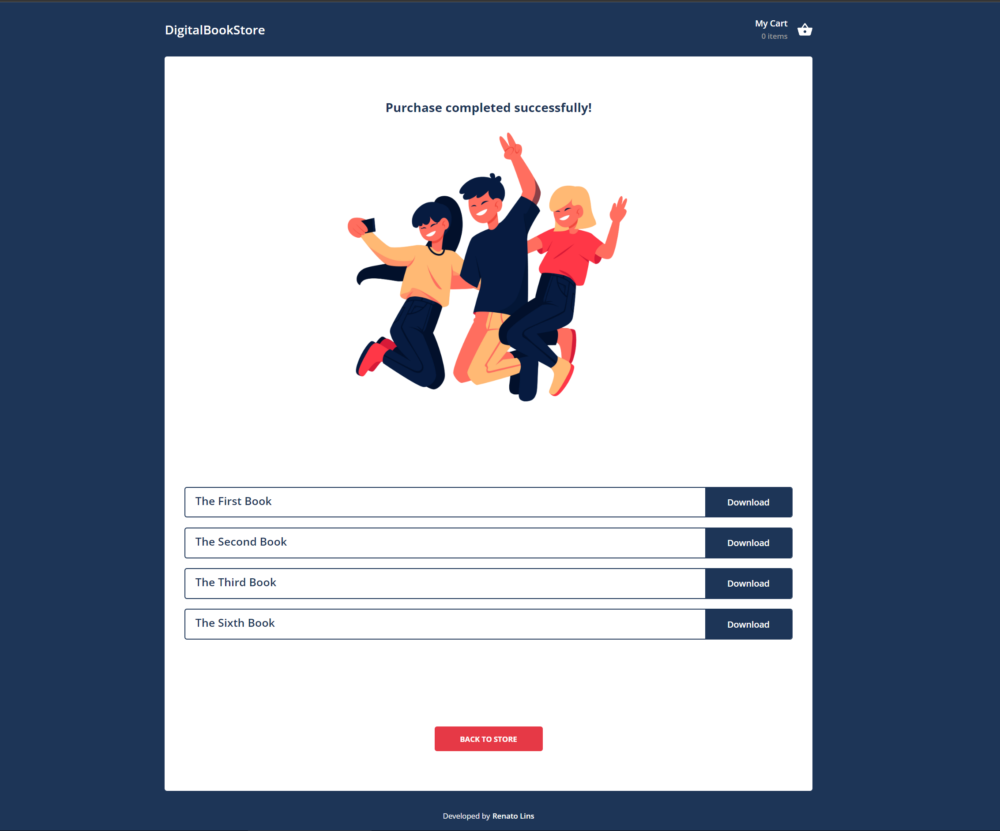

# DigitalBookStore by Renato Lins

A simple store app made with React. You can check the application working here: https://digitalbookstore.netlify.app.

## How the application looks like




## Commands

- Formatting: `yarn format`
- Running the project: `yarn dev`
- Building the project: `yarn build`
- Manual deploy (Netlify): `netlify deploy --prod --dir=dist`

## Main Technologies used

- React
- Typescript
- Sass (global styling)
- Redux (w/ Redux Toolkit)
- Styled components (with Javascript syntax)

## Key features/characteristics

- Responsive
- Theme-based styling
- Routing is fully implemented
- Codebase is fully typed with TypeScript
- Data fetching and parsing from a real API
- Clear separation of domain-specific components from shared components
- Redux Toolkit configured with both synchronous and asynchronous reducers
- Shared folder with presentation components functioning as a design system
- Everything is a component, either a React component or a styled component
- Project is configured for absolute imports (no long and confusing import paths)

## Top-Level Folders

- **global-styles**: Resets and sets core styling for the entire application.

- **theme**: Manages themeable styling for the app, supporting features like dark mode or user-selectable themes.

- **shared**: Code used across the app, not tied to any domain. This could evolve into a private/internal library for other projects. Contains shared components, models, icons, hooks, etc.

- **domain**: The main module of the application. If the app expands, similar folders (e.g., "users," "payment") will be added for each new domain, containing relevant components, pages, icons, and hooks. Domains can have multiple sub-routes like "users/registration" or "users/reports".

## Images

This application avoids using a separate assets folder to enhance scalability. The `<Image>` component understands this separation, allowing us to utilize domain-specific, shared, and external images seamlessly.

## Responsiveness

The application uses a custom hook called useResponsiveBooleans to manage responsive behavior. This hook combines the application's pre-defined breakpoints with the mobile-detect library, providing size information through JavaScript instead of media queries or CSS mixins. This approach has several benefits:

- Mobile optimization: Ideal for mobile-focused apps or those being ported to mobile.
- Consistent sizing: Designers and developers are encouraged to use the same terminology for sizing.
- No CSS changes: Components handle values from a custom hook, eliminating the need to modify CSS.
- Easier development: Sizes are mapped to booleans, allowing developers to focus on component behavior rather than figuring out sizes.

Easy usage: Access hook values like this:

```javascript
return {
  isSmall, // In mobile mode or small screen on desktop - Width < 960px
  isSmaller, // Width < 768px or small screen on desktop
  isSuperSmall, // Width or height <= 480px
  isInMobileMode, // Device detected as mobile or tablet
  isDesktopBigScreen, // Not in mobile mode and screen size >= 1280px
  isDesktopSmallScreen // Not in mobile mode and screen size < 1280px
};
```

Then we just pass values to our components already. For example:

```javascript
<MyComponent maxWidth={isSuperSmall ? 255 : 290} />
```

## Tests

Despite a few testing files are present, tests are not implemented yet.

## Improvement possibilities (Out of scope)

- Translation
- A main menu
- Breadcrumbs
- Dark/Light mode toggling
- Authentication/Authorization
- Integration with an actual store
- Infinite Scroll and/or Pagination
- Better page transition animations
- UI feedback using Toastr messages
- A more robust error handling approach
- etc
